---
## Front matter
title: "Лабораторная работа №3"
subtitle: "Подготовил"
author: "Холов Икром"

## Generic otions
lang: ru-RU
toc-title: "Содержание"

## Bibliography
bibliography: bib/cite.bib
csl: pandoc/csl/gost-r-7-0-5-2008-numeric.csl

## Pdf output format
toc: true # Table of contents
toc-depth: 2
lof: true # List of figures
lot: true # List of tables
fontsize: 12pt
linestretch: 1.5
papersize: a4
documentclass: scrreprt
## I18n polyglossia
polyglossia-lang:
  name: russian
  options:
	- spelling=modern
	- babelshorthands=true
polyglossia-otherlangs:
  name: english
## I18n babel
babel-lang: russian
babel-otherlangs: english
## Fonts
mainfont: IBM Plex Serif
romanfont: IBM Plex Serif
sansfont: IBM Plex Sans
monofont: IBM Plex Mono
mathfont: STIX Two Math
mainfontoptions: Ligatures=Common,Ligatures=TeX,Scale=0.94
romanfontoptions: Ligatures=Common,Ligatures=TeX,Scale=0.94
sansfontoptions: Ligatures=Common,Ligatures=TeX,Scale=MatchLowercase,Scale=0.94
monofontoptions: Scale=MatchLowercase,Scale=0.94,FakeStretch=0.9
mathfontoptions:
## Biblatex
biblatex: true
biblio-style: "gost-numeric"
biblatexoptions:
  - parentracker=true
  - backend=biber
  - hyperref=auto
  - language=auto
  - autolang=other*
  - citestyle=gost-numeric
## Pandoc-crossref LaTeX customization
figureTitle: "Рис."
tableTitle: "Таблица"
listingTitle: "Листинг"
lofTitle: "Список иллюстраций"
lotTitle: "Список таблиц"
lolTitle: "Листинги"
## Misc options
indent: true
header-includes:
  - \usepackage{indentfirst}
  - \usepackage{float} # keep figures where there are in the text
  - \floatplacement{figure}{H} # keep figures where there are in the text
---

# Цель работы

Цель данной работы заключается в изучении концепции и исследования
систем контроля версий, а так же приобретения практических навыков
работы с системой git.

# Выполнение лабораторной работы

1. Указание имя и email владельца репозитория (рис.[-@fig:001])

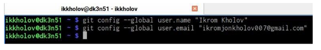{#fig:001 width=100%}

2.  Настроил utf-8 в выводе сообщений (рис. [-@fig:002]) 

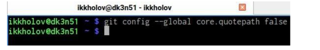{#fig:002}

3. Задал имя начальной ветки (рис. [-@fig:003])

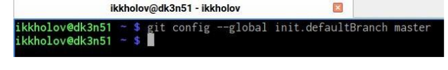{#fig:003}

4. Настроил параметры autocrIf и safecrIf [-@fig:004])

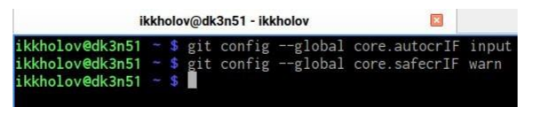{#fig:004}

5. Создание SSH ключа (рис. [-@fig:005])

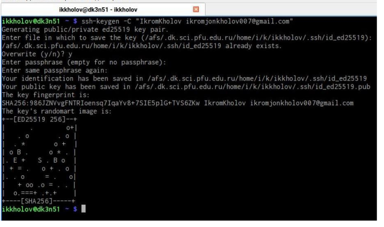{#fig:005}

6. Скопировал ключ в буфер обмена (рис. [-@fig:006])

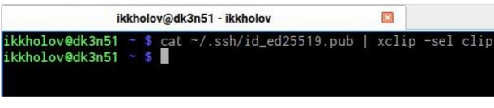{#fig:006}

7. Добавил ключ на сайт
Создание рабочего пространства и репозитория
курса на основе шаблона (рис. [-@fig:007])

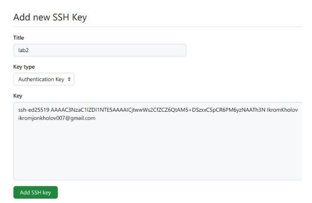{#fig:007}

8. Создал каталог для предмета “Архитектура компьютера” (рис. [-@fig:008])

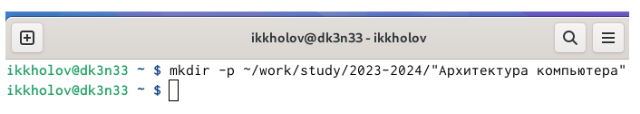{#fig:008}

9. Создаю репозиторий на основе шаблона (рис. [-@fig:009])

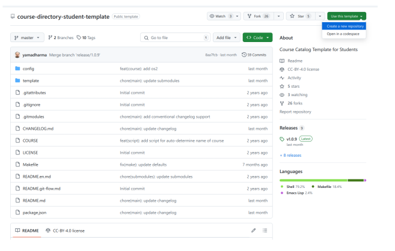{#fig:009}

10. Вписываю название и создаю репозиторий (рис. [-@fig:010])

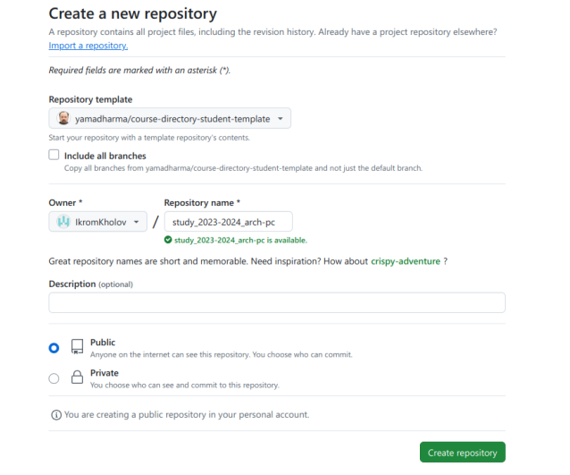{#fig:010}

11. Перешел в папку “Архитектура компьютера” (рис. [-@fig:011])

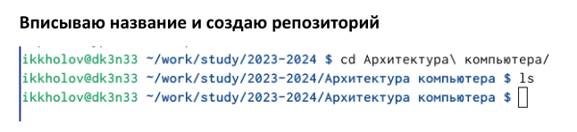{#fig:011}

12. Клонировал созданный репозиторий (рис. [-@fig:012])

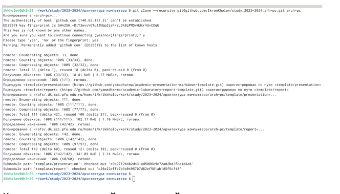{#fig:012}

13. Настройка каталога курса (рис. [-@fig:013])

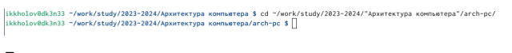{#fig:013}

14. Перешел в каталог курса (рис. [-@fig:014])

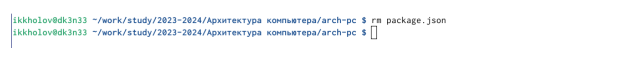{#fig:014}

15. Удалил лишние файлы (рис. [-@fig:015])

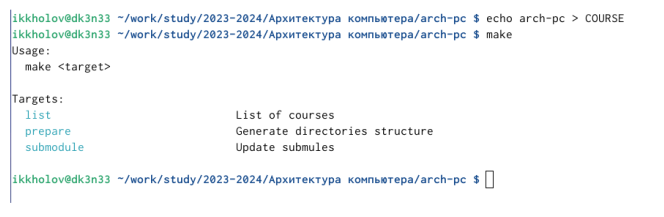{#fig:015} 

16. Создал нужные каталоги (рис. [-@fig:016])

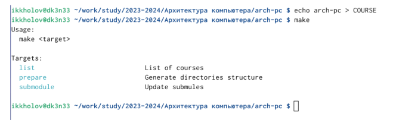{#fig:016}

17. Oтправляю файлы на сервер (рис. [-@fig:017])

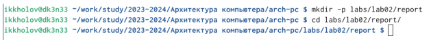{#fig:017}

18. Создал каталог для отчета (рис. [-@fig:018])

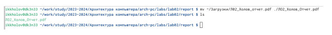{#fig:018}

19. Переместил созданный отчет из загрузок в каталог report (рис. [-@fig:019])

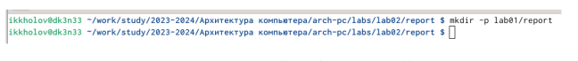{#fig:019}

20. Создал папку для отчета о первой лабораторной (рис. [-@fig:020])

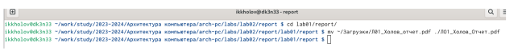{#fig:020}

21. Загрузил файла на github (рис. [-@fig:021])

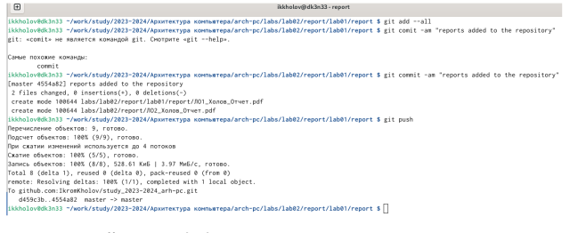{#fig:021}

# Вывод

Изучил идеологию и как применять средства
контроля версий. Научился на практике, как
работать с git.

