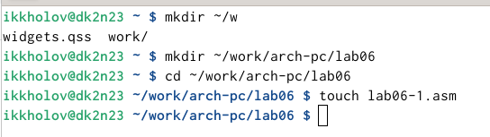

---
## Front matter
title: "Лабараторная работа №06. НКАбд-01-24"
subtitle: "Подготовил:"
author: "Холов Икром. Студенческий номер: 1032249215"

## Generic otions
lang: ru-RU
toc-title: "Содержание"

## Bibliography
bibliography: bib/cite.bib
csl: pandoc/csl/gost-r-7-0-5-2008-numeric.csl

## Pdf output format
toc: true # Table of contents
toc-depth: 2
lof: true # List of figures
lot: true # List of tables
fontsize: 12pt
linestretch: 1.5
papersize: a4
documentclass: scrreprt
## I18n polyglossia
polyglossia-lang:
  name: russian
  options:
	- spelling=modern
	- babelshorthands=true
polyglossia-otherlangs:
  name: english
## I18n babel
babel-lang: russian
babel-otherlangs: english
## Fonts
mainfont: IBM Plex Serif
romanfont: IBM Plex Serif
sansfont: IBM Plex Sans
monofont: IBM Plex Mono
mathfont: STIX Two Math
mainfontoptions: Ligatures=Common,Ligatures=TeX,Scale=0.94
romanfontoptions: Ligatures=Common,Ligatures=TeX,Scale=0.94
sansfontoptions: Ligatures=Common,Ligatures=TeX,Scale=MatchLowercase,Scale=0.94
monofontoptions: Scale=MatchLowercase,Scale=0.94,FakeStretch=0.9
mathfontoptions:
## Biblatex
biblatex: true
biblio-style: "gost-numeric"
biblatexoptions:
  - parentracker=true
  - backend=biber
  - hyperref=auto
  - language=auto
  - autolang=other*
  - citestyle=gost-numeric
## Pandoc-crossref LaTeX customization
figureTitle: "Рис."
tableTitle: "Таблица"
listingTitle: "Листинг"
lofTitle: "Список иллюстраций"
lotTitle: "Список таблиц"
lolTitle: "Листинги"
## Misc options
indent: true
header-includes:
  - \usepackage{indentfirst}
  - \usepackage{float} # keep figures where there are in the text
  - \floatplacement{figure}{H} # keep figures where there are in the text
---

# Цель работы

Освоить арифметические инструкций языка ассемблера в NASM.

# Выполнение лабораторной работы

1. Создал каталог для програм лабораторной работы № 6 и перешел в него
и создал файл lab6-1.asm (рис. [-@fig:001])

{#fig:001 width=100%}

2. Ввел в файл lab6-1.asm текст программы из листинга 6.1 (рис. [-@fig:002])

{#fig:002 width=100%}

3.  Создал исполняемый файл и запустил его (рис. [-@fig:003]).

{#fig:003 width=100%}

4. Изменил текст программы и вместо символов, записал в регистры числа (рис. [-@fig:004]).

{#fig:004 width=100%}

5.  Создал исполняемый файл и запустил его (рис. [-@fig:005]).

{#fig:005 width=100%}

6.  Создал файл lab6-2.asm в каталоге ~/work/arch-pc/lab06 и ввел в него текст программы (рис. [-@fig:006]) (рис. [-@fig:007]).

{#fig:006 width=100%}
 
{#fig:007 width=100%}

7. Создал исполняемый файл и запустил его (рис. [-@fig:008]).

{#fig:008 width=100%}

8. Изменил файл lab6-2.asm (рис. [-@fig:009]).

{#fig:009 width=100%}

9. Создал исполняемый файл и запустил его (рис. [-@fig:010]).

{#fig:010 width=100%}

10. Заменил функцию iprintLF на iprint (рис. [-@fig:011]).

{#fig:011 width=100%}

11. Создал исполняемый файл и запустил его (рис. [-@fig:012]). iprintLF после вывода так-же переносит строку, в отличие от iprint.

{#fig:012 width=100%}

12. Cоздал файл lab6-3.asm в каталоге ~/work/arch-pc/lab06 и заполнил lab6-3.asm (рис. [-@fig:014]).

{#fig:014 width=100%}

13. Создал исполняемый файл и запустил его (рис. [-@fig:015]).

{#fig:015 width=100%}

14. Изменил текст программы для вычисления выражения f(x) = (4 * 6 + 2)/5 (рис. [-@fig:016]).

{#fig:016 width=100%}

15. Cоздал исполняемый файл и запустил его (рис. [-@fig:017]).

{#fig:017}

16. Создал файл variant.asm в каталоге ~/work/arch-pc/lab06 (рис. [-@fig:018]).

{#fig:018}

17. Заполнил variant.asm (рис. [-@fig:019]).

{#fig:019}

18. Cоздал исполняемый файл и запустил его (рис. [-@fig:020]).

{#fig:020 width=100%}

Ответы на вопросы:
	1. Какие строки листинга 6.4 отвечают за вывод на экран сообщения ‘Ваш вариант:’?
		mov eax,rem
		call sprint
	2. Для чего используется следующие инструкции?
		mov ecx, x
		mov edx, 80
		call sread
	Для полученния данных с клавиатуры.
	
	3. Для чего используется инструкция “call atoi”?
	Для преобразования ASCII кода в число
	
	4. Какие строки листинга 6.4 отвечают за вычисления варианта?
		xor edx,edx
		mov ebx,20
		div ebx
		inc edx
		
	5. В какой регистр записывается остаток от деления при выполнении инструкции “div ebx”?
	В edx
	
	6. Для чего используется инструкция “inc edx”?
	Увелечение edx на 1
	
	7. Какие строки листинга 6.4 отвечают за вывод на экран результата вычислений?
		mov eax,edx
		call iprintLF

# Самостоятельная работа

1. Создал файл worksam.asm и заполнил его для вычесления (10x − 5)^2 (вариант №16) (рис. [-@fig:021]).

{#fig:021 width=100%}

2. Cоздал исполняемый файл и проверил его работу на 8 и 64 (рис. [-@fig:022]).

{#fig:022 width=100%}

# Выводы

Теперь я освоил арифметические инструкции языка ассемблера в NASM!
