---
## Front matter
title: "Лабараторная работа №07. НКАбд-01-24"
subtitle: "Подготовил:"
author: "Холов Икром. Студенческий номер: 1032249215"

## Generic otions
lang: ru-RU
toc-title: "Содержание"

## Bibliography
bibliography: bib/cite.bib
csl: pandoc/csl/gost-r-7-0-5-2008-numeric.csl

## Pdf output format
toc: true # Table of contents
toc-depth: 2
lof: true # List of figures
lot: true # List of tables
fontsize: 12pt
linestretch: 1.5
papersize: a4
documentclass: scrreprt
## I18n polyglossia
polyglossia-lang:
  name: russian
  options:
	- spelling=modern
	- babelshorthands=true
polyglossia-otherlangs:
  name: english
## I18n babel
babel-lang: russian
babel-otherlangs: english
## Fonts
mainfont: IBM Plex Serif
romanfont: IBM Plex Serif
sansfont: IBM Plex Sans
monofont: IBM Plex Mono
mathfont: STIX Two Math
mainfontoptions: Ligatures=Common,Ligatures=TeX,Scale=0.94
romanfontoptions: Ligatures=Common,Ligatures=TeX,Scale=0.94
sansfontoptions: Ligatures=Common,Ligatures=TeX,Scale=MatchLowercase,Scale=0.94
monofontoptions: Scale=MatchLowercase,Scale=0.94,FakeStretch=0.9
mathfontoptions:
## Biblatex
biblatex: true
biblio-style: "gost-numeric"
biblatexoptions:
  - parentracker=true
  - backend=biber
  - hyperref=auto
  - language=auto
  - autolang=other*
  - citestyle=gost-numeric
## Pandoc-crossref LaTeX customization
figureTitle: "Рис."
tableTitle: "Таблица"
listingTitle: "Листинг"
lofTitle: "Список иллюстраций"
lotTitle: "Список таблиц"
lolTitle: "Листинги"
## Misc options
indent: true
header-includes:
  - \usepackage{indentfirst}
  - \usepackage{float} # keep figures where there are in the text
  - \floatplacement{figure}{H} # keep figures where there are in the text
---

# Цель работы

Изучение команд условного и безусловного переходов. Приобретение навыков написания
программ с использованием переходов. Знакомство с назначением и структурой файла
листинга

# Выполнение лабораторной работы

1. Создал каталог для програм лабораторной работы № 7 и перешел в него
и создал файл lab07-1.asm (рис. [-@fig:001])

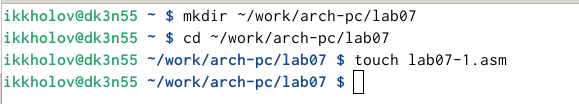{#fig:001 width=100%}

2. Ввел в файл lab7-1.asm текст программы из листинга 7.1 (рис. [-@fig:002])

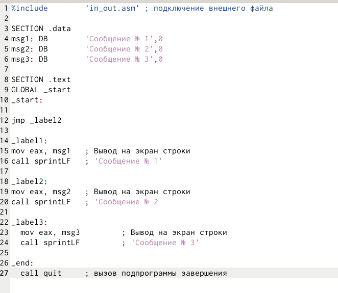{#fig:002 width=100%}

3. Создал исполняемый файл и запустил его (рис. [-@fig:003]).

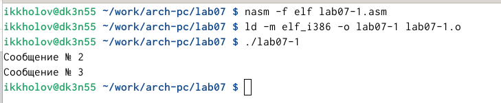{#fig:003 width=100%}

4. Изменил текст программы  (рис. [-@fig:004]).

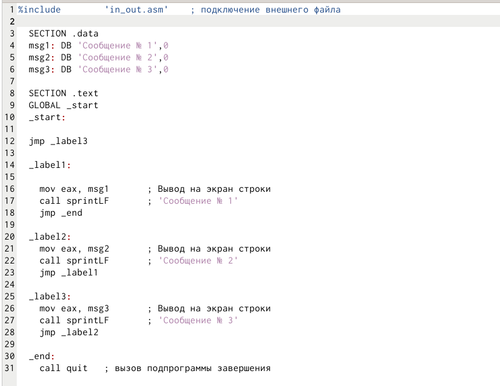{#fig:004 width=100%}

5. Запустил измененный текст  (рис. [-@fig:005]).

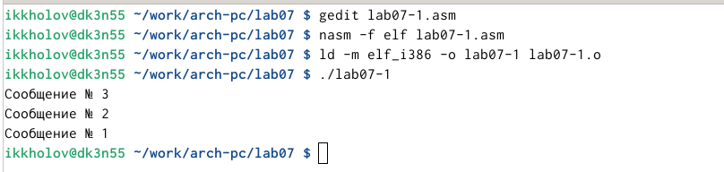{#fig:005 width=100%}

6. Создал и заполнил lab07-2 (рис. [-@fig:006])

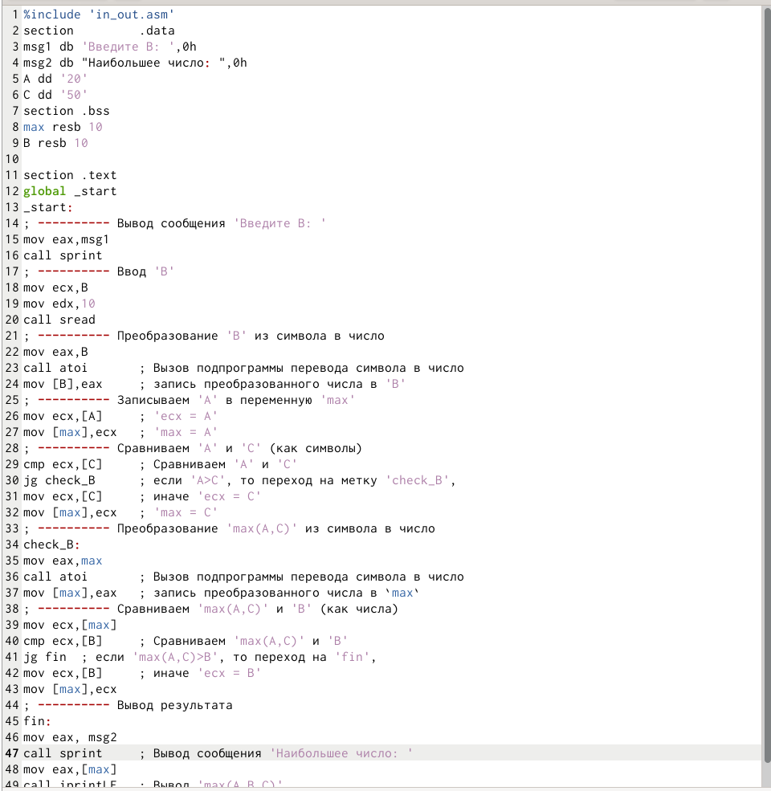{#fig:006 width=100%}

7. Запустил lab07-2 (рис. [-@fig:007])

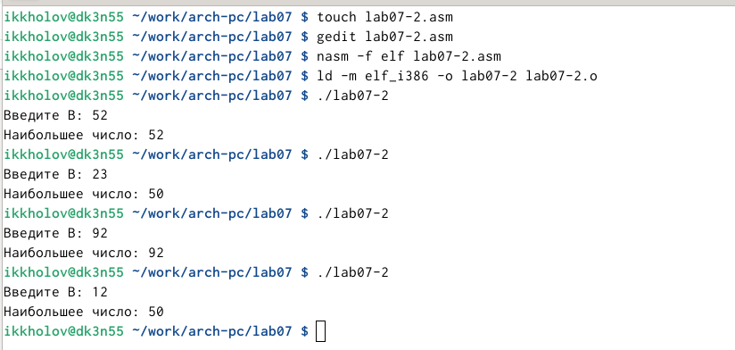{#fig:007 width=100%}

8.  Компиляция_с_листингом (рис. [-@fig:008]).

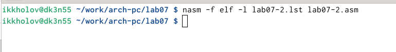{#fig:008 width=100%}

 Задания для самостоятельной работы

9. Создал каталог для самостоятельной работы (рис. [-@fig:009]).

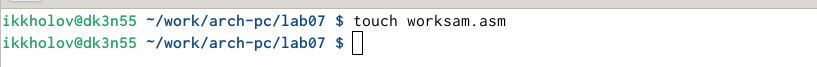{#fig:009 width=100%}

10.  Заполнил 1 задание самостоятельной (рис. [-@fig:010]).

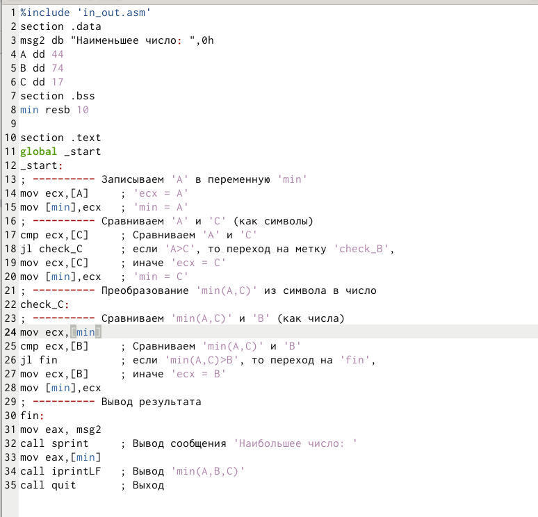{#fig:010 width=100%}

11. Запустил 1 задание самостоятельной (рис. [-@fig:011])

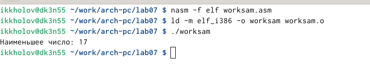{#fig:011 width=100%}

12.  Заполнил 2 задание самостоятельной (рис. [-@fig:012])

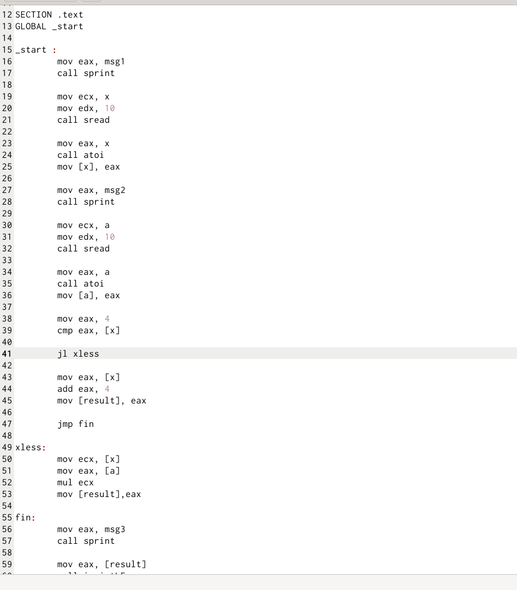{#fig:012 width=100%}

13.  Проверил 2 задание самостоятельной  (рис. [-@fig:013]).

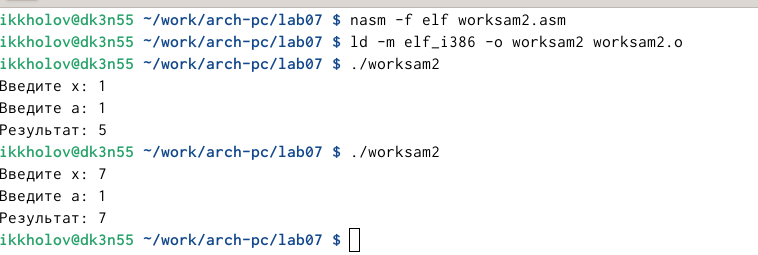{#fig:013 width=100%}

# Выводы

Я смог завершить 7-ую лабораторную

