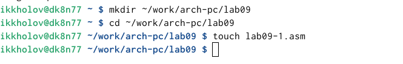

---
## Front matter
title: "Лабараторная работа №09. НКАбд-01-24"
subtitle: "Подготовил:"
author: "Холов Икром Комронович"

## Generic otions
lang: ru-RU
toc-title: "Содержание"

## Bibliography
bibliography: bib/cite.bib
csl: pandoc/csl/gost-r-7-0-5-2008-numeric.csl

## Pdf output format
toc: true # Table of contents
toc-depth: 2
lof: true # List of figures
lot: true # List of tables
fontsize: 12pt
linestretch: 1.5
papersize: a4
documentclass: scrreprt
## I18n polyglossia
polyglossia-lang:
  name: russian
  options:
	- spelling=modern
	- babelshorthands=true
polyglossia-otherlangs:
  name: english
## I18n babel
babel-lang: russian
babel-otherlangs: english
## Fonts
mainfont: IBM Plex Serif
romanfont: IBM Plex Serif
sansfont: IBM Plex Sans
monofont: IBM Plex Mono
mathfont: STIX Two Math
mainfontoptions: Ligatures=Common,Ligatures=TeX,Scale=0.94
romanfontoptions: Ligatures=Common,Ligatures=TeX,Scale=0.94
sansfontoptions: Ligatures=Common,Ligatures=TeX,Scale=MatchLowercase,Scale=0.94
monofontoptions: Scale=MatchLowercase,Scale=0.94,FakeStretch=0.9
mathfontoptions:
## Biblatex
biblatex: true
biblio-style: "gost-numeric"
biblatexoptions:
  - parentracker=true
  - backend=biber
  - hyperref=auto
  - language=auto
  - autolang=other*
  - citestyle=gost-numeric
## Pandoc-crossref LaTeX customization
figureTitle: "Рис."
tableTitle: "Таблица"
listingTitle: "Листинг"
lofTitle: "Список иллюстраций"
lotTitle: "Список таблиц"
lolTitle: "Листинги"
## Misc options
indent: true
header-includes:
  - \usepackage{indentfirst}
  - \usepackage{float} # keep figures where there are in the text
  - \floatplacement{figure}{H} # keep figures where there are in the text
---

# Цель работы

Приобретение навыков написания программ с использованием подпрограмм. Знакомство
с методами отладки при помощи GDB и его основными возможностями

# Выполнение лабораторной работы

1. Создал lab09-1.asm (рис. [-@fig:001])

{#fig:001}

2. Заполнил lab09-1 (рис. [-@fig:002])

{#fig:002}

3. Проверил lab09-1 (рис. [-@fig:003])

{#fig:003}

4. Создал lab09-2.asm (рис. [-@fig:004])

{#fig:004}

5. Заполнил lab09-2 (рис. [-@fig:005])

{#fig:005}

6. Проверил_lab09-2 (рис. [-@fig:006])

{#fig:006}

7. Загрузил исполняемый файл (рис. [-@fig:007])

{#fig:007}

8. Проверил исполняемый файл (рис. [-@fig:008])

{#fig:008}

9. Установил брейкпоинт (рис. [-@fig:009])

{#fig:009}

10. Посмотрел дисассимилированный код (рис. [-@fig:010])

{#fig:010}

11. Переключился на отображение команд (рис. [@-fig:011])

{#fig:011}

12. Включил режим псевдографики (рис. [-@fig:012])

{#fig:012}

13. Перечислил различия (рис. [-@fig:013])

{#fig:013}

14. Установил еще одну точку останова (рис. [-@fig:014])

{#fig:014}

15. Посмотрел информацию о всех установленных точках останова (рис. [-@fig:015])

{#fig:015}

16. Посмотрел значение переменной msg1 по имени (рис. [-@fig:016])

{#fig:016}

17. Изменил первый символ переменной msg1 (рис. [-@fig:017])

{#fig:017}

18. Изменил значение регистра (рис. [-@fig:018])

{#fig:018}

19. Скопировал файл lab08-2.asm (рис. [-@fig:019])

{#fig:019}

20. Создал исполняемый файл (рис. [-@fig:020])

{#fig:020}

21. Загрузил исполняемый файл (рис. [-@fig:021])

{#fig:021}

22. Установил точку (рис. [-@fig:022])

{#fig:022}

23. Посмотрел остальные позиции стека (рис. [-@fig:023])

{#fig:024}

# Выводы

Завершил лабораторную номер 9

